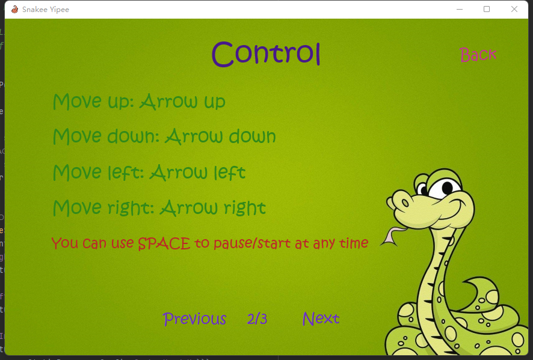
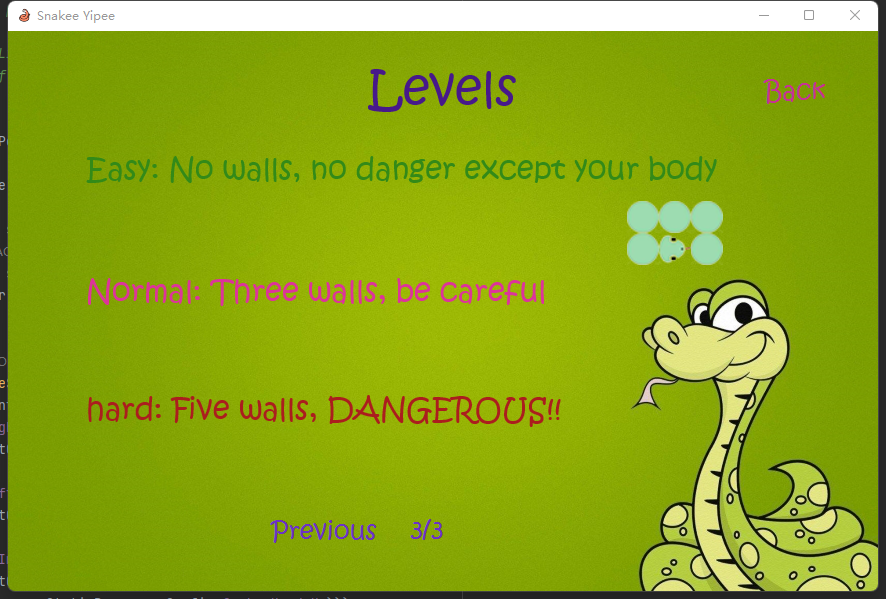

# Comp2013_Coursework  
## Author Information  
* Name: Yunchi Zhao
* Email: scyyz17@nottingham.ac.uk

## Project Description
* This is a snake game that developed in Java and Javafx.
* Users can play the classic content and experience some innovation at the same time.
    - Different levels of difficulty.
    - Creative score calculation.

## How to install and run the project
1. Open the YunchiZhao_18.zip file.
2. Go to YunchiZhao_18.  
3. There is 2 ways to run this project.
    - Run the class Start_controller in Intellj.
    - Use "mvn clean javafx:run" to run at command line.
4. The game screen will show up.

## How to play the game
1. click Start button.  
  
2. Users can change the settings of game in this screen, can click Help button  
to see detailed information.  
 
3.  The basic rules for this game.  
 
4.  How to Play.  
 
5. Different levels.  
 